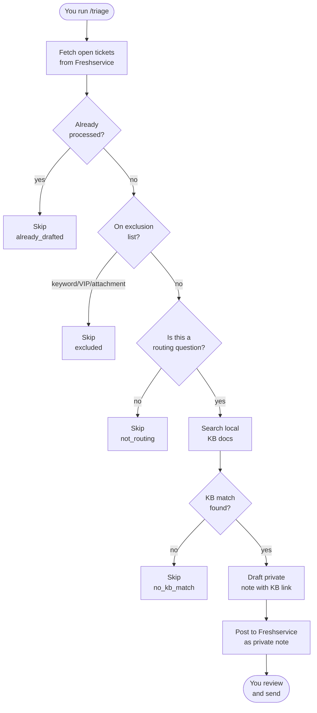
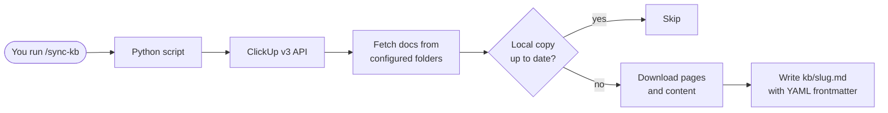
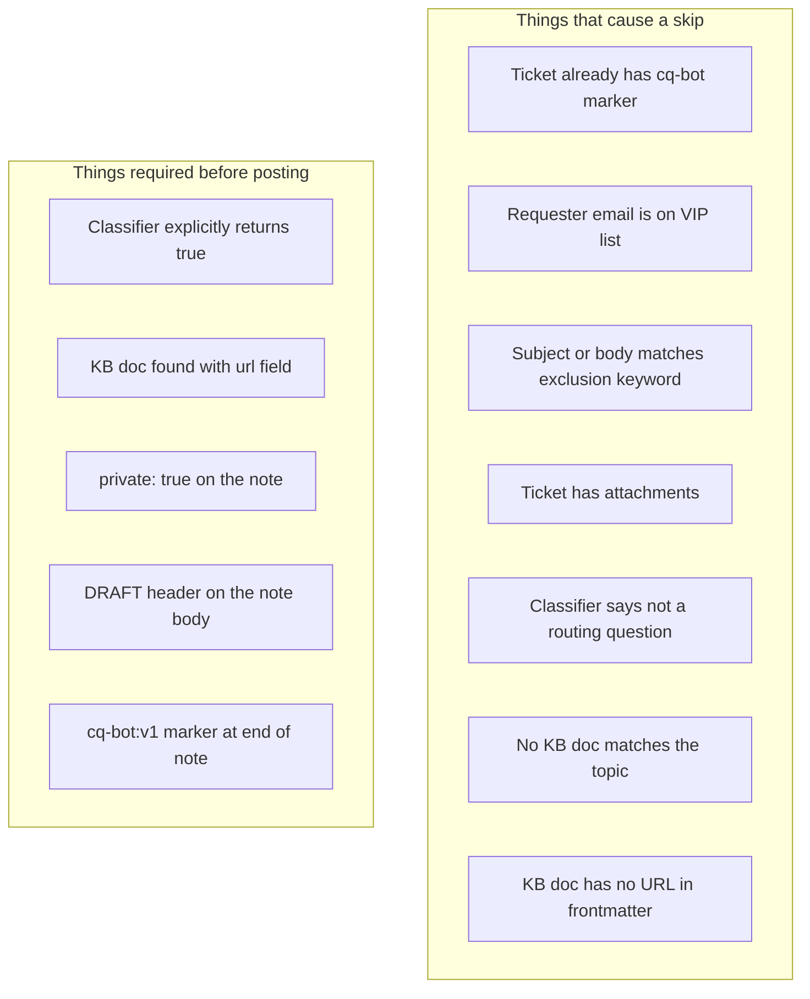

# constantquestions

You keep getting Freshservice tickets that all ask the same thing: "Where do I request X?" or "Who do I contact about Y?" The answers already exist in your ClickUp docs — you just don't want to keep copy-pasting them manually.

This tool watches your Freshservice queue, identifies those routing questions, looks up the answer in your ClickUp KB, and drafts a private reply note on the ticket for you. You review it and hit send. It never sends anything on its own.

---

## What it does



Every ticket either gets a draft or gets skipped with a logged reason. Nothing is sent automatically.

---

## How the KB sync works

Your ClickUp docs are the source of truth. The sync script pulls them down to a local `kb/` folder as plain Markdown files so they can be searched with a simple grep.



Each local file gets a frontmatter block like this:

```yaml
---
clickup_doc_id: abc123
title: How to Request a New Laptop
url: https://app.clickup.com/v/dc/...
date_updated: 2024-03-01T10:00:00+00:00
---
```

The `url` field is what gets included in every drafted reply so the requester has a link to the full doc.

---

## File structure

```
constantquestions/
├── .claude/
│   └── commands/
│       ├── triage.md       # /triage slash command — the main workflow
│       └── sync-kb.md      # /sync-kb slash command — runs the KB sync
├── config/
│   ├── exclusions.yaml     # who and what to never auto-process
│   └── prompts/
│       ├── classifier.md   # LLM prompt: is this a routing question?
│       └── draft_reply.md  # LLM prompt: write the reply note
├── scripts/
│   └── sync_clickup_kb.py  # ClickUp v3 API → kb/*.md
├── kb/                     # local doc cache (gitignored)
├── .env.example
├── requirements.txt
└── README.md
```

---

## Safety rails

The system is designed to do nothing when in doubt.



Every drafted note looks like this in Freshservice:

```
**DRAFT — review before sending**

Hi Alex,

To request a new laptop, submit a ticket through the IT Service Portal
under Hardware Requests. The team typically responds within 2 business days.

You can find more details and submit your request here:
https://app.clickup.com/v/dc/...

Let me know if you have any questions.

<!-- cq-bot:v1 -->
```

The `<!-- cq-bot:v1 -->` comment is invisible to the requester in Freshservice's rendered view but lets the system detect on re-runs that the ticket was already handled.

---

## Setup

**1. Install dependencies**

```bash
pip install -r requirements.txt
```

**2. Configure environment**

```bash
cp .env.example .env
```

Fill in `.env`:

```
CLICKUP_TOKEN=pk_xxxxxxxxxxxx        # Settings → Apps → API Token in ClickUp
CLICKUP_WORKSPACE_ID=12345678        # Your numeric workspace ID
CLICKUP_DOC_FOLDER_IDS=id1,id2      # Folder IDs that hold your routing docs
```

**3. Connect Freshservice MCP**

The `/triage` command calls Freshservice via the `mcp__freshservice-mcp` MCP server. This must be configured and authenticated in Claude Code before running `/triage`. If it is missing, you will see MCP tool errors.

**4. Populate the KB**

```bash
/sync-kb
```

This must be run at least once before `/triage` — there is nothing to search until the KB has docs.

---

## Usage

```bash
/sync-kb                          # pull latest ClickUp docs into kb/

/triage                           # process open tickets from the last 24h (up to 10)
/triage --limit 5                 # process at most 5 tickets
/triage --since 48h               # look back 48 hours instead of 24
/triage --dry-run                 # classify and search KB but post nothing to Freshservice
```

After each run, `/triage` prints a summary table:

```
| Ticket ID | Subject                                  | Action                  | KB Source             |
|-----------|------------------------------------------|-------------------------|-----------------------|
| 12345     | Where do I request a new laptop?         | drafted                 | laptop-requests.md    |
| 12346     | My email keeps crashing                  | skipped:not_routing     | —                     |
| 12347     | CEO request — urgent                     | excluded:keyword        | —                     |
| 12348     | How do I get VPN access?                 | drafted                 | vpn-access.md         |
| 12349     | Where do I order a standing desk?        | skipped:no_kb_match     | —                     |
```

---

## Customizing

**Add VIP emails or blocked keywords** — edit `config/exclusions.yaml`. Any email listed under `vip_emails` will never be auto-processed. Any regex under `exclusion_keywords` matched against the ticket subject and body will cause a skip.

**Change what counts as a routing question** — edit `config/prompts/classifier.md`. The examples and decision rules there define the classifier's behavior. Making it more permissive (by adding example types) will draft more tickets; making it stricter will draft fewer.

**Add more ClickUp folders to sync** — add folder IDs to `CLICKUP_DOC_FOLDER_IDS` in `.env` and re-run `/sync-kb`.

---

## What is out of scope in v1

- **Auto-send** — stays draft-only until there is enough history to trust the output rate
- **Vector/semantic search** — plain grep works well for short routing queries; revisit if recall becomes a problem
- **Webhook or scheduled trigger** — on-demand only; no background process
- **How-to questions, break-fix, password resets** — the classifier is intentionally narrow; those ticket types are always skipped
